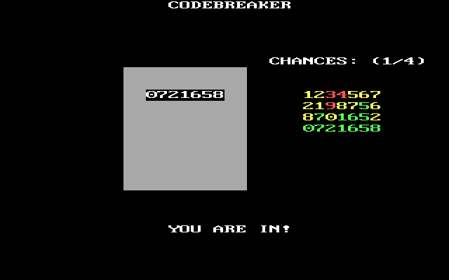

## Codebreaker
A number based bootsector game (contained fully within 512 Bytes) written in x86 assembly (Intel syntax) targeting 16-bit real mode.



### Inspiriation
The game itself is not an original idea and taken from the game [>//:System.Hack](https://store.steampowered.com/app/557330/SystemHack/).
It came to my attention through the youtube content creators called [FunHaus](https://youtu.be/gqUL91_4rPg?t=256).

### Prerequisites
- [Make](https://www.gnu.org/software/make/)
- [NASM](https://www.nasm.us/)
- [QEMU](https://www.qemu.org/)

### Building from source
- `git clone https://github.com/powware/codebreaker`
- `make` to build

### Usage
`make run` to execute the binary
#### Gameplay
Your goal is to figure out a secret code within a set amount of chances. The desired code is made up of digits between 0-9 where each digit is unique and the order is important. You enter digits and press enter to evaluate your input. Each of your entered digits will be color coded to give feedback on how close you are towards the desired code:
- red: The digit is not present in the desired code.
- yellow: The digit is present but at the wrong position in your input.
- green: The digit is present and at the correct position.

In other words: you want your code to evaluate to all digits as green. Whether you achieve this goal within the given amount of tries decides if you win or lose.

#### Tweaks
At present the code length and amount of chanes are hard coded. You can change these values and rebuild for a different gameplay experience:
```asm
code_length equ 7
chances_message db "CHANCES: (4/4)", 0
```